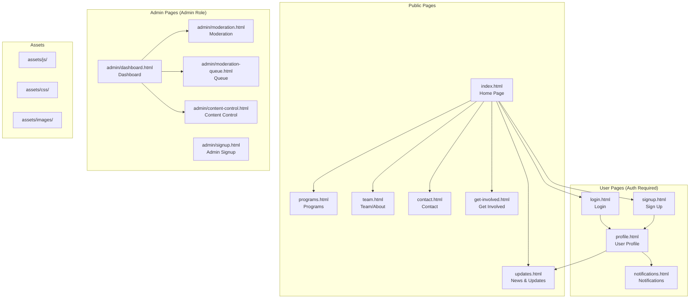
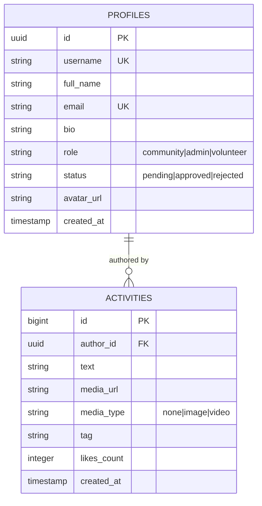
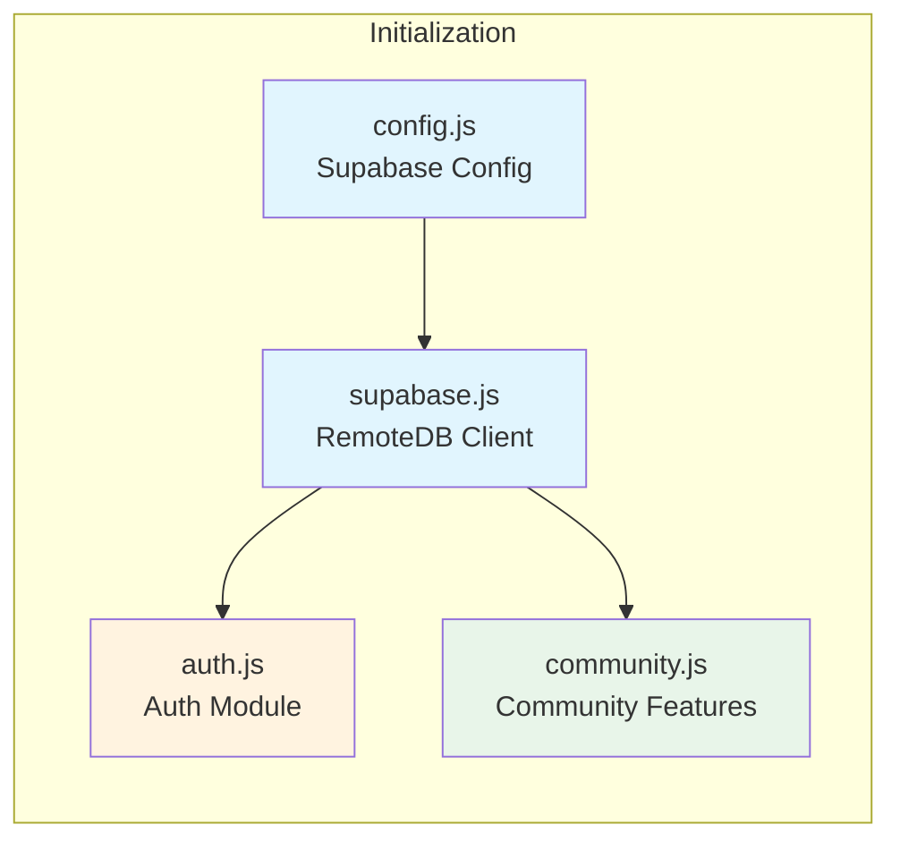
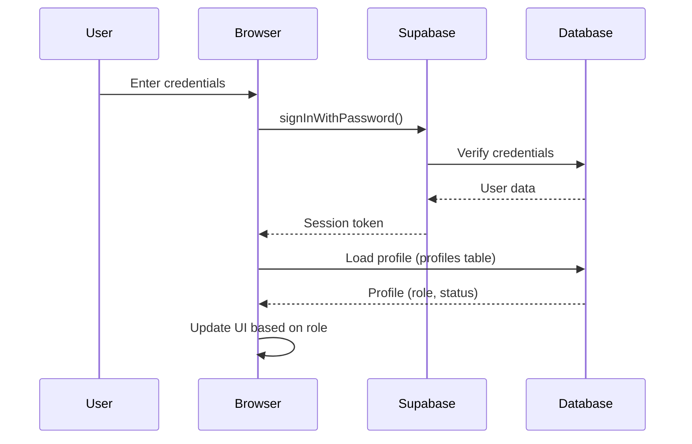
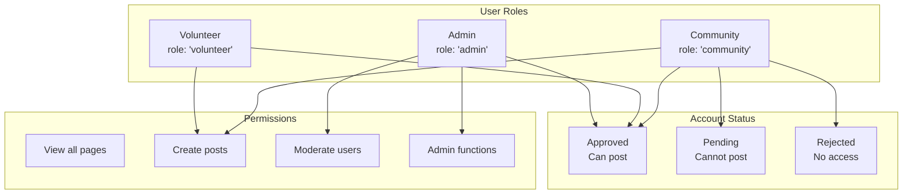
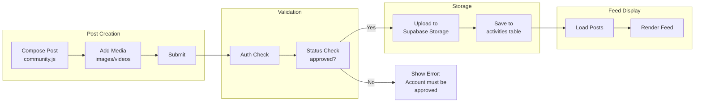
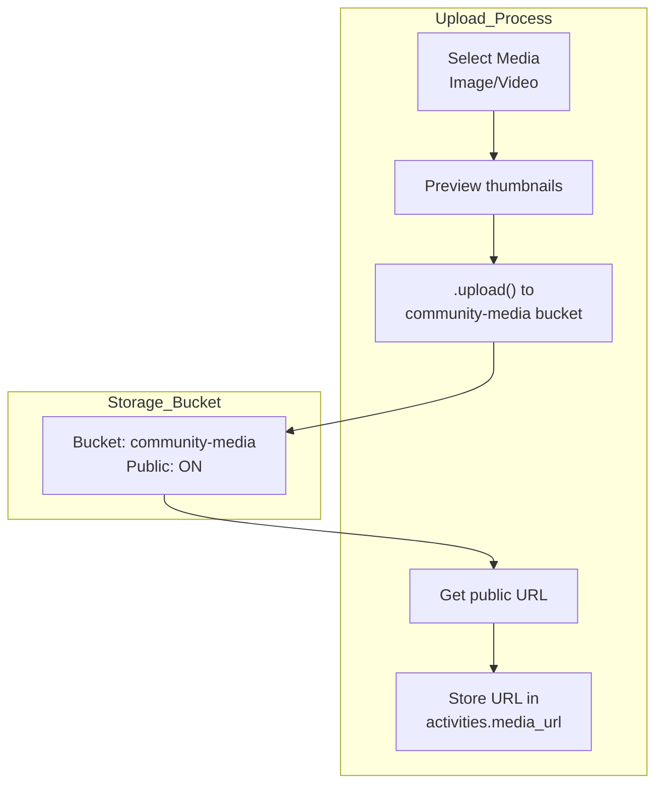

# Oasis of Hope Website - System Architecture

## Overview
The Oasis of Hope website is a multi-page web application with authentication, user roles, community features, and admin moderation capabilities. It uses Supabase as its backend-as-a-service platform.

---

## 1. File Structure & Page Relationships



---

## 2. Database Schema & Relationships

### Tables

| Table | Purpose | Key Fields |
|-------|---------|------------|
| `profiles` | User accounts & roles | id, username, email, role, status, avatar_url |
| `activities` | Community posts | id, author_id, text, media_url, media_type, tag, likes_count |



---

## 3. JavaScript Module Dependencies



### Module Responsibilities

| Module | File | Responsibility |
|--------|------|----------------|
| Configuration | [`assets/js/config.js`](assets/js/config.js) | Stores Supabase URL and API key |
| Database Client | [`assets/js/supabase.js`](assets/js/supabase.js) | Initializes Supabase client, provides CRUD methods |
| Authentication | [`assets/js/auth.js`](assets/js/auth.js) | Login, register, logout, session management |
| Community | [`assets/js/community.js`](assets/js/community.js) | Post composer, feed rendering, media handling |

---

## 4. Authentication Flow



### Login Options
1. **Email + Password**: Direct login
2. **Username + Password**: Looks up email from profiles table, then authenticates

### Registration Roles
- Default: `role = 'community'`, `status = 'pending'`
- Admin: Use secret key `OASIS_ADMIN_2026` → `role = 'admin'`, `status = 'approved'`

---

## 5. User Role & Permission System



### Role Permissions

| Role | View Content | Create Posts | Moderate Users | Access Admin |
|------|--------------|--------------|----------------|--------------|
| Admin | ✓ | ✓ | ✓ | ✓ |
| Volunteer | ✓ | ✓ (if approved) | ✗ | ✗ |
| Community | ✓ | ✓ (if approved) | ✗ | ✗ |

### Account Status Flow
```
New User Registers → Status: 'pending' → Admin approves → Status: 'approved' → Can post
                                                        → Admin rejects → Status: 'rejected' → Cannot post
```

---

## 6. Page Navigation & Access Control

### Public Pages (No Auth Required)
- [`index.html`](index.html) - Home
- [`programs.html`](programs.html) - Programs
- [`team.html`](team.html) - Team/About
- [`updates.html`](updates.html) - News & Stories
- [`contact.html`](contact.html) - Contact
- [`get-involved.html`](get-involved.html) - Get Involved

### User Pages (Login Required)
- [`login.html`](login.html) - Login
- [`signup.html`](signup.html) - Sign Up
- [`profile.html`](profile.html) - User Profile (edit)
- [`notifications.html`](notifications.html) - Notifications

### Admin Pages (Admin Role Required)
- [`admin/dashboard.html`](admin/dashboard.html) - Admin Dashboard
- [`admin/moderation.html`](admin/moderation.html) - User Moderation
- [`admin/moderation-queue.html`](admin/moderation-queue.html) - Approval Queue
- [`admin/content-control.html`](admin/content-control.html) - Content Management
- [`admin/signup.html`](admin/signup.html) - Admin Registration

---

## 7. Community Post Flow



---

## 8. Supabase Security (Row Level Security)

### Profile Policies
| Operation | Condition |
|-----------|-----------|
| SELECT | Everyone can view |
| INSERT | Users can insert own profile |
| UPDATE | Users can update own (except role/status) |
| ALL (Admin) | Admins have full access |

### Activity Policies
| Operation | Condition |
|-----------|-----------|
| SELECT | Everyone can view |
| INSERT | Only approved users or admins |
| DELETE | Only post author |

---

## 9. Media Upload System



---

## 10. Key Data Relationships Summary

| Feature | Data Source | Key Tables | Flow |
|---------|-------------|------------|------|
| User Authentication | Supabase Auth | `auth.users` | Login → Session → Profile |
| User Profile | profiles table | `profiles` | Auto-created on signup |
| Community Posts | activities table | `profiles` → `activities` | Join on author_id |
| Role Management | profiles.role | `profiles` | Controls UI & permissions |
| Moderation | profiles.status | `profiles` | Pending → Approved/Rejected |
| Media Storage | Supabase Storage | `community-media` bucket | Upload → URL → DB |

---

## 11. Technology Stack

| Layer | Technology |
|-------|------------|
| Frontend | HTML5, Tailwind CSS, Vanilla JavaScript |
| Backend | Supabase (PostgreSQL + Auth + Storage) |
| External APIs | Google Fonts, Material Symbols |
| Hosting | Static files (any static host) |

---

## 12. Configuration

The Supabase connection is configured in [`assets/js/config.js`](assets/js/config.js):

```javascript
window.SUPABASE_CONFIG = {
    url: 'https://gdweuicswzgncxqfgbxy.supabase.co',
    key: 'sb_publishable_uq9jcG75OH5ywv4yVE9bUg_Jgg5Yh2G'
};
```

---

## Summary

The Oasis of Hope website is a **multi-tenant community platform** with:

1. **Three user roles**: Admin, Volunteer, Community
2. **Two-step approval**: Users register → pending → admin approves → can post
3. **Centralized authentication**: Supabase Auth handles all sessions
4. **Database-backed profiles**: Extended user data stored in `profiles` table
5. **Community feed**: Posts with media, linked to authors via foreign keys
6. **Admin moderation**: Full control over users and content
7. **Media storage**: Supabase Storage bucket for images/videos
